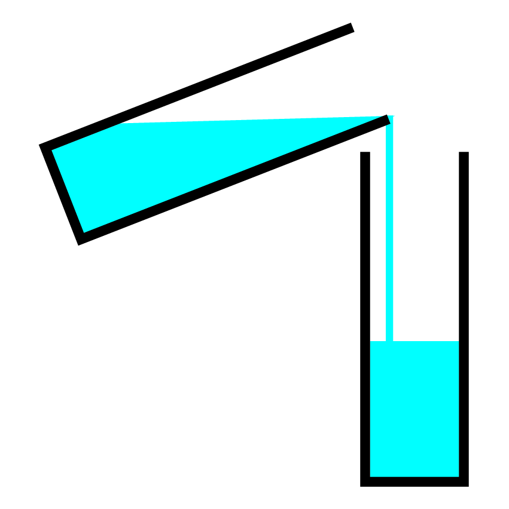
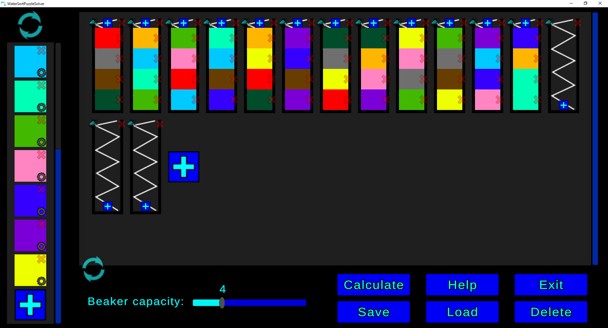
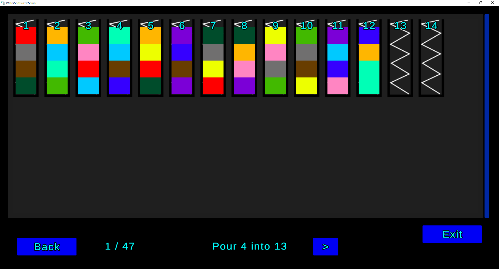
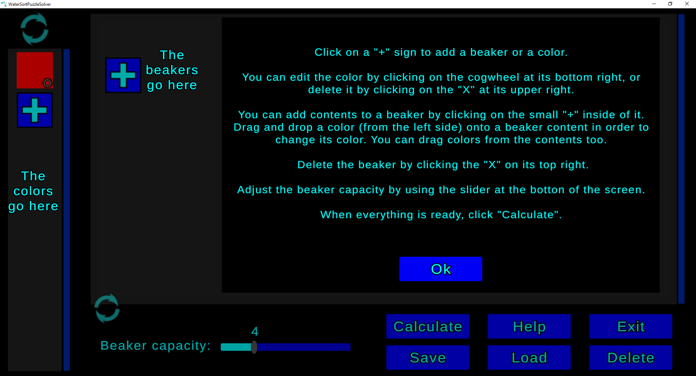

<!-- PROJECT LOGO -->

    
  </a>

  <h1 align="left">Sort Puzzle Solver</h1>

### Run in browser on itch.io >>>> [here](https://teo3fl.itch.io/sort-puzzle-solver)

<!-- ABOUT THE PROJECT -->
## About The Project

The purpose of this application is to find and display the solution for a given initial state, which consists of a number of beakers that are filled with mixed colored liquids. The desired state (solution) would have all beakers containing only liquids of a single color. The solution (if it exists) is to be determined by using the A* algorithm.

It provides functionalities such as:
* adding as many beakers and color samples as needed
* filling beakers to up to 10 colors
* picking custom color shades
* dragging and dropping colors from the color shade list, or from the beaker contents themselves
* simple UI that displays step-by-step how to reach the solution for the given combination

<!-- Download -->
## Download
1. Get the .zip [here](https://github.com/teo3fl/WaterSortPuzzleSolver/releases)
2. Extract
3. Run "WaterSortPuzzleSolver.exe"

<!-- USAGE EXAMPLES -->
## Usage

<b>Step 1:</b> create the initial state, then press <i>Calculate</i>. 
 
 
 
 
<b>Step 2:</b> wait until it finds the solution, then follow the steps. 
 
 
 
 
 
If you have a hard time navigating the UI, press the <i>Help</i> button; everything is explained. 
 

(<a href="#top">back to top</a>)

